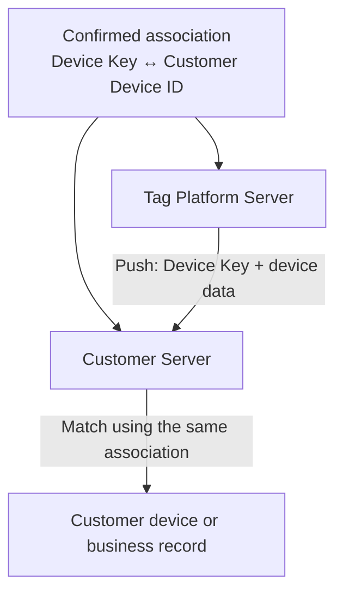

# Tag Server Integration Guide

Tag Platform provides two ways for customer servers to receive Tag device data: Push Delivery and OpenAPI. Private Deployment can also be evaluated when customer data must be stored independently.

For Chinese documentation, see [中文说明](README_zh.md).

## Integration Options

| Option | How it works | Typical use |
| --- | --- | --- |
| Push Delivery | Tag Platform sends device data to the customer server through Webhook, TCP, or UDP | The customer wants to receive new data automatically |
| OpenAPI | The customer server queries Tag Platform when data is needed | The customer wants to control query and synchronization schedules |
| Private Deployment | Evaluated separately for each project | Data must be stored in the customer's country, region, or own server environment |

## 1. Push Delivery

Tag Platform sends data for the agreed Tag devices to the receiving service provided by the customer.



### 1.1 Integration Process

1. Tag Platform provides a Device Key table for the Tag devices assigned to the customer.
2. The customer associates each Device Key with its own device, asset, user, or business record.
3. The customer returns the completed mapping table and provides the test and production receiving addresses.
4. Tag Platform configures Push Delivery and sends test data.
5. The customer verifies device association, data parsing, storage, and business processing.
6. Both parties confirm the production launch.

### 1.2 Information Provided by the Customer

| Item | Required | Description |
| --- | --- | --- |
| Customer name | Yes | Company or organization name |
| Delivery method | Yes | Webhook, TCP, or UDP |
| Test receiving address | Recommended | Test URL or server address and port |
| Production receiving address | Yes | Production URL or server address and port |
| Network requirements | As needed | VPN, IP allowlist, firewall, or other access requirements |
| Authentication requirements | As needed | Token, request signature, mutual TLS, or other requirements |
| Technical contact | Yes | Contact name and email for testing and support |
| Device Key mapping | Yes | Completed mapping between Device Keys provided by Tag Platform and customer device IDs |

### 1.3 Device Association

Before Push Delivery is enabled, Tag Platform and the customer must confirm the same association between each Device Key provided by Tag Platform and the corresponding customer device ID. This association must exist on both servers so that every pushed record can be matched to the correct customer device, asset, user, or business record.

A Tag device may have one primary Device Key and zero or more secondary Device Keys. The primary Device Key is used for the main association and OpenAPI queries. Secondary Device Keys belong to the same device. Tag Platform provides the applicable primary-to-secondary relationship; the customer should not infer or create this relationship independently.

Tag Platform provides the applicable Device Keys, and the customer provides the corresponding device IDs. The pushed `publicKey` is the matching key used by the customer server. If either side uses a different association, the data cannot be matched correctly.

Device Keys must be preserved exactly as provided and transferred and stored securely.

### 1.4 Webhook

The customer provides an HTTP or HTTPS endpoint. Tag Platform sends a JSON array to that endpoint using HTTP `POST`.

```http
POST {customer-provided-url}
Content-Type: application/json; charset=utf-8
```

Example payload—all values are fictitious:

```json
[
  {
    "publicKey": "00112233445566778899aabbccddeeff00112233445566778899aabb",
    "collectionTime": "2026-08-29 10:30:00",
    "status": "42",
    "batteryLevel": "85",
    "coordinate": "113.934528,22.540503",
    "imei": "CUSTOMER-DEVICE-001",
    "utctime": 1787970600000
  }
]
```

| Field | JSON type | Description |
| --- | --- | --- |
| `publicKey` | String | Primary Device Key used to associate the data with the customer device |
| `collectionTime` | String or `null` | Location collection time in `yyyy-MM-dd HH:mm:ss`, UTC+08:00 |
| `status` | String or `null` | Location type and accuracy value; value meanings are provided during onboarding |
| `batteryLevel` | String or `null` | Raw battery value reported by the device; conversion to a percentage is confirmed during onboarding |
| `coordinate` | String or `null` | WGS-84 coordinate in `longitude,latitude` order |
| `imei` | String or `null` | This field is always present. Its value is the customer `deviceId` when configured; otherwise it is JSON `null`. |
| `utctime` | Number or `null` | Location collection time as a Unix timestamp in milliseconds |

One Webhook request contains a JSON array of one or more records. The delivery frequency, expected delay, request timeout, and retry policy are confirmed before launch.

The customer endpoint should return HTTP `2xx` after accepting the complete request. A timeout or non-`2xx` response is treated as a delivery failure. Until a retry policy has been agreed, the customer must not assume a fixed retry count or interval. The receiving operation should be idempotent so duplicate records can be handled safely.

### 1.5 TCP or UDP

For TCP or UDP delivery, the customer provides a reachable server address and port. Tag Platform supports JT/T 808 and other GPS protocols. The protocol and data format are confirmed during onboarding and verified with test data before production launch.

The customer is responsible for maintaining the receiving service, associating incoming device identifiers with its own records, and handling storage and business processing.

## 2. OpenAPI Integration

OpenAPI allows the customer server to query Tag location data on demand. The customer controls the query schedule and data synchronization process.

### 2.1 Integration Process

1. Tag Platform provides the API address, API Key, API Secret, and applicable Device Key table.
2. The customer stores the credentials securely on its server.
3. The customer associates each Device Key with the corresponding record in its own system.
4. The customer completes request signing and tests the API.
5. The customer confirms data parsing, storage, error handling, and query scheduling.
6. Both parties confirm the production launch.

### 2.2 Service and Endpoints

The production base URL is provided during onboarding. Example:

```text
https://api.example.com
```

| Operation | Method and path | Description |
| --- | --- | --- |
| Query one Device Key | `GET /fit/openapi/deviceData/v1` | Queries location data for one primary Device Key; result items do not include `publicKey` |
| Query multiple Device Keys | `GET /fit/openapi/deviceDataList/v1` | Queries multiple primary Device Keys in one request; each result item includes `publicKey` |

The test environment and applicable query limits are provided during onboarding. The order of batch results is not guaranteed; match each result to the requested device by `publicKey`.

### 2.3 API Credentials

| Credential | Description |
| --- | --- |
| API Key | Customer identifier sent as the `apikey` request parameter |
| API Secret | Secret used to calculate the request signature; it is not sent in the request |

The API Secret must be stored in protected server-side configuration and must not be committed to source control or written to logs.

### 2.4 Request Information

| Parameter | Description |
| --- | --- |
| `apikey` | API Key provided by Tag Platform |
| `sign` | Request signature calculated with the API Secret according to the signing rules provided by Tag Platform |
| `nonce` | Random value generated for each request |
| `timestamp` | Current Unix timestamp in seconds |
| `publicKey` | Primary Device Key for a single-device query |
| `publicKeys` | Comma-separated primary Device Keys for a batch query |
| `timePeriod` | Preset query period |
| `startTime`, `endTime` | Custom query period in `yyyy-MM-dd HH:mm:ss`, UTC+08:00 |

Use either `timePeriod`, or both `startTime` and `endTime`. The API Secret is used only to calculate `sign` and is never included directly in the request. Exact signing rules and supported query periods are supplied with the integration credentials.

### 2.5 Response

Single-device response example:

```json
{
  "code": 0,
  "message": "OK",
  "data": [
    {
      "batteryLevel": "85",
      "collectionTime": "2026-08-29 10:30:00",
      "status": "42",
      "coordinate": "113.934528,22.540503"
    }
  ]
}
```

Batch response example:

```json
{
  "code": 0,
  "message": "OK",
  "data": [
    {
      "publicKey": "00112233445566778899aabbccddeeff00112233445566778899aabb",
      "batteryLevel": "85",
      "collectionTime": "2026-08-29 10:30:00",
      "status": "42",
      "coordinate": "113.934528,22.540503"
    }
  ]
}
```

| Field | JSON type | Description |
| --- | --- | --- |
| `code` | Number | Business status code; `0` means success |
| `message` | String or `null` | Result or error message |
| `data` | Array | Location record array; it is `[]`, not `null`, when no data is available |
| `data[].publicKey` | String | Included only in batch-query results to identify the Device Key |
| `data[].batteryLevel` | String or `null` | Raw battery value reported by the device |
| `data[].collectionTime` | String or `null` | Location collection time in `yyyy-MM-dd HH:mm:ss`, UTC+08:00 |
| `data[].status` | String or `null` | Location type and accuracy value, interpreted in the same way as the Webhook `status` field |
| `data[].coordinate` | String or `null` | WGS-84 coordinate in `longitude,latitude` order |

Push Delivery and OpenAPI intentionally use different payload structures. Push records include `imei` and `utctime`; OpenAPI records do not. Integrations should parse the two structures separately.

### 2.6 Error Handling

A `code` of `0` means success. For a nonzero `code`, use `message` for details. The customer should check both the HTTP status and business `code` when handling the response.

## 3. Private Deployment

If customer data must be stored independently in the customer's country, region, or own server environment, the feasibility of Private Deployment can be evaluated for the specific project.

## Contact

To set up Push Delivery, request OpenAPI credentials, or discuss Private Deployment, contact [ble_tag888@163.com](mailto:ble_tag888@163.com).

## Revision History

**1.0** (2026.08.29)

- Initial public release
