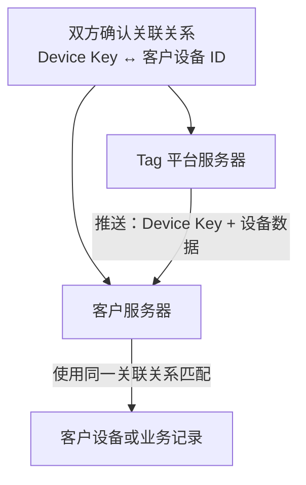

# Tag 服务器对接指南

Tag 平台为客户服务器提供两种 Tag 设备数据对接方式：数据推送和 OpenAPI。客户数据需要独立保存时，也可以单独评估私有化部署。

For English documentation, see [README.md](README.md).

## 对接方式

| 方式 | 对接模式 | 适用场景 |
| --- | --- | --- |
| 数据推送 | Tag 平台通过 Webhook、TCP 或 UDP 向客户服务器发送设备数据 | 客户希望自动接收新数据 |
| OpenAPI | 客户服务器需要数据时主动查询 Tag 平台 | 客户希望自行控制查询和同步计划 |
| 私有化部署 | 根据具体项目单独评估 | 数据需要保存在客户所在国家、地区或客户自有服务器环境 |

## 1. 数据推送

Tag 平台将约定范围内的 Tag 设备数据发送至客户提供的接收服务。



### 1.1 对接流程

1. Tag 平台提供分配给客户的 Device Key 表。
2. 客户将每个 Device Key 与自己的设备、资产、用户或业务记录建立关联。
3. 客户返回填写完成的映射表，并提供测试和生产接收地址。
4. Tag 平台配置数据推送并发送测试数据。
5. 客户验证设备关联、数据解析、保存及业务处理。
6. 双方确认生产环境上线。

### 1.2 客户提交信息

| 项目 | 是否必填 | 说明 |
| --- | --- | --- |
| 客户名称 | 是 | 公司或组织名称 |
| 推送方式 | 是 | Webhook、TCP 或 UDP |
| 测试接收地址 | 建议提供 | 测试 URL 或服务器地址和端口 |
| 生产接收地址 | 是 | 生产 URL 或服务器地址和端口 |
| 网络要求 | 按需 | VPN、IP 白名单、防火墙或其他接入要求 |
| 认证要求 | 按需 | Token、请求签名、双向 TLS 或其他要求 |
| 技术联系人 | 是 | 用于联调和支持的联系人姓名及邮箱 |
| Device Key 映射 | 是 | Tag 平台提供的 Device Key 与客户设备 ID 的对应关系 |

### 1.3 设备关联

开通数据推送前，Tag 平台与客户必须确认平台提供的每个 Device Key 和客户设备 ID 的对应关系。两边服务器都需要保存并使用同一份关联关系，推送数据才能正确匹配到客户的设备、资产、用户或业务记录。

一个 Tag 设备可以包含一个主 Device Key 和零个或多个从 Device Key。主 Device Key 用于主要关联和 OpenAPI 查询，从 Device Key 属于同一设备。主从 Device Key 关系由 Tag 平台提供，客户不应自行推断或创建该关系。

Tag 平台提供适用的 Device Key，客户提供对应的设备 ID。推送数据中的 `publicKey` 是客户服务器匹配设备时使用的关键字段。如果两边使用的关联关系不一致，数据将无法正确匹配。

Device Key 必须按 Tag 平台提供的内容原样保存，并采用安全方式传输和保存。

### 1.4 Webhook

客户提供 HTTP 或 HTTPS 接收地址，Tag 平台通过 HTTP `POST` 发送 JSON 数组。

```http
POST {客户提供的URL}
Content-Type: application/json; charset=utf-8
```

示例——以下所有值均为虚构数据：

```json
[
  {
    "publicKey": "00112233445566778899aabbccddeeff00112233445566778899aabb",
    "collectionTime": "2026-08-29 10:30:00",
    "status": "42",
    "batteryLevel": "85",
    "coordinate": "113.934528,22.540503",
    "imei": "CUSTOMER-DEVICE-001",
    "utctime": 1787970600000
  }
]
```

| 字段 | JSON 类型 | 说明 |
| --- | --- | --- |
| `publicKey` | String | 用于关联客户设备的主 Device Key |
| `collectionTime` | String 或 `null` | 定位采集时间，格式 `yyyy-MM-dd HH:mm:ss`，时区 UTC+08:00 |
| `status` | String 或 `null` | 定位类型和精度值，取值含义在对接时提供 |
| `batteryLevel` | String 或 `null` | 设备上报的原始电量值；如需转换为百分比，转换规则在对接时确认 |
| `coordinate` | String 或 `null` | WGS-84 坐标，顺序为 `经度,纬度` |
| `imei` | String 或 `null` | 该字段始终存在。配置了客户 `deviceId` 时取其值，否则为 JSON `null`。 |
| `utctime` | Number 或 `null` | 定位采集时间对应的 Unix 毫秒时间戳 |

每次 Webhook 请求包含一条或多条记录组成的 JSON 数组。推送频率、预期延迟、请求超时和重试策略由双方在上线前确认。

客户接收端完整接受请求后应返回 HTTP `2xx`。请求超时或非 `2xx` 响应按推送失败处理。在双方确认重试策略前，客户不应假定固定的重试次数或间隔。接收处理应具备幂等性，以便安全处理重复记录。

### 1.5 TCP 或 UDP

选择 TCP 或 UDP 时，客户提供可访问的服务器地址和端口。Tag 平台支持 JT/T 808 等 GPS 协议。双方在对接阶段确认协议和数据格式，并通过测试数据验证后再上线生产环境。

客户负责维护数据接收服务，将收到的设备标识与自己的设备记录关联，并完成数据保存和业务处理。

## 2. OpenAPI 对接

OpenAPI 允许客户服务器按需查询 Tag 定位数据，查询计划和数据同步过程由客户控制。

### 2.1 对接流程

1. Tag 平台提供 API 地址、API Key、API Secret 和适用的 Device Key 表。
2. 客户在服务器端安全保存凭证。
3. 客户将每个 Device Key 与自己系统中的设备记录建立关联。
4. 客户完成请求签名并测试接口。
5. 客户确认数据解析、保存、错误处理和查询计划。
6. 双方确认生产环境上线。

### 2.2 服务地址和接口

生产环境基础地址在对接时提供。示例：

```text
https://api.example.com
```

| 操作 | 请求方式与路径 | 说明 |
| --- | --- | --- |
| 查询一个 Device Key | `GET /fit/openapi/deviceData/v1` | 查询一个主 Device Key 的定位数据；结果记录不包含 `publicKey` |
| 批量查询 Device Key | `GET /fit/openapi/deviceDataList/v1` | 一次查询多个主 Device Key；每条结果包含 `publicKey` |

测试环境和适用的查询限制在对接时提供。批量查询结果不保证与请求顺序一致，客户应使用 `publicKey` 匹配对应设备。

### 2.3 API 凭证

| 凭证 | 说明 |
| --- | --- |
| API Key | 客户身份标识，通过请求参数 `apikey` 发送 |
| API Secret | 用于计算请求签名，不随请求发送 |

API Secret 必须保存在受保护的服务器配置中，不得提交到代码仓库或写入日志。

### 2.4 请求信息

| 参数 | 说明 |
| --- | --- |
| `apikey` | Tag 平台提供的 API Key |
| `sign` | 根据 Tag 平台提供的签名规则，使用 API Secret 计算的请求签名 |
| `nonce` | 每次请求生成的随机值 |
| `timestamp` | 当前 Unix 秒时间戳 |
| `publicKey` | 单设备查询使用的主 Device Key |
| `publicKeys` | 批量查询使用的主 Device Key，多个 Key 使用英文逗号分隔 |
| `timePeriod` | 预设查询时间范围 |
| `startTime`、`endTime` | 自定义查询时间范围，格式 `yyyy-MM-dd HH:mm:ss`，时区 UTC+08:00 |

使用 `timePeriod`，或同时使用 `startTime` 和 `endTime`；两种方式二选一。API Secret 只用于计算 `sign`，不会直接放入请求。具体签名规则和支持的查询时间范围随对接凭证一同提供。

### 2.5 响应数据

单设备查询响应示例：

```json
{
  "code": 0,
  "message": "OK",
  "data": [
    {
      "batteryLevel": "85",
      "collectionTime": "2026-08-29 10:30:00",
      "status": "42",
      "coordinate": "113.934528,22.540503"
    }
  ]
}
```

批量查询响应示例：

```json
{
  "code": 0,
  "message": "OK",
  "data": [
    {
      "publicKey": "00112233445566778899aabbccddeeff00112233445566778899aabb",
      "batteryLevel": "85",
      "collectionTime": "2026-08-29 10:30:00",
      "status": "42",
      "coordinate": "113.934528,22.540503"
    }
  ]
}
```

| 字段 | JSON 类型 | 说明 |
| --- | --- | --- |
| `code` | Number | 业务状态码，`0` 表示成功 |
| `message` | String 或 `null` | 结果或错误信息 |
| `data` | Array | 定位记录数组；无数据时为 `[]`，不会是 `null` |
| `data[].publicKey` | String | 仅批量查询结果包含，用于标识 Device Key |
| `data[].batteryLevel` | String 或 `null` | 设备上报的原始电量值 |
| `data[].collectionTime` | String 或 `null` | 定位采集时间，格式 `yyyy-MM-dd HH:mm:ss`，时区 UTC+08:00 |
| `data[].status` | String 或 `null` | 定位类型和精度值，解释方式与 Webhook 的 `status` 字段相同 |
| `data[].coordinate` | String 或 `null` | WGS-84 坐标，顺序为 `经度,纬度` |

数据推送与 OpenAPI 有意采用不同的数据结构。推送记录包含 `imei` 和 `utctime`，OpenAPI 记录不包含这两个字段，客户应分别解析两种数据结构。

### 2.6 错误处理

`code` 为 `0` 表示成功；非零 `code` 可参考 `message` 了解详情。客户处理响应时应同时检查 HTTP 状态和业务 `code`。

## 3. 私有化部署

如果客户要求数据独立保存，并存放在客户所在国家、地区或客户自有服务器环境，可以根据具体项目评估私有化部署的可行性。

## 联系方式

如需对接数据推送、申请 OpenAPI 凭证或讨论私有化部署，请联系对接负责人。

## 修订记录

**1.0**（2026.08.29）

- 首次公开发布
